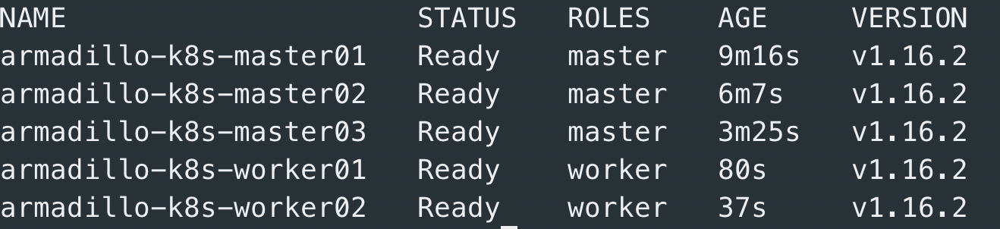
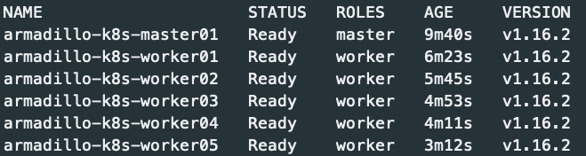

# ARMadillo

"ARMadillo" is a "pet project", created to provide a way to deploy Kubernetes cluster on Raspberry Pi in both a single and a multi-master topologies, all using simple bash scripts and leveraging the native capabilities of the [kubeadm project](https://kubernetes.io/docs/reference/setup-tools/kubeadm/kubeadm/).

This repo provide the software stack of ARMadillo. For an overview of the hardware stack and the buildout process, please visit the [ARMadillo](http://thewalkingdevs.io/tag/armadillo/) page on my personal blog.

## Architecture
### ARMadillo Kubernetes Multi-Master Deployment Hardware Architecture


### ARMadillo Kubernetes Single Master Deployment Hardware Architecture


## Perquisites
### Preparing the Pi's

1. Download the Raspbian OS zip image. ARMadillo was tested working on both [raspbian stretch](https://downloads.raspberrypi.org/raspbian/images/raspbian-2019-04-09/) and [raspbian buster lite](https://www.raspberrypi.org/downloads/raspbian/).


2. The LAN the Pi's are connected to needs to be DHCP-enabled. 

3. Flashing the Pi and the deploy Raspbian is easy. First, download and install [balenaEtcer](https://www.balena.io/etcher/?ref=etcher_footer).
    -   Insert SD card to your SD card reader.
    -   Select the Raspbian zip file you've just downloaded.
    -   Select the SD card and hit the "Flash!".
    -   Once flashing is done, re-insert the SD card to your SD card reader (as balenaEtcer will unmount the SD card)
    -   Create *ssh* file and copy it to the */boot* partition. This is required to be able ssh the Pi. 
    -   Insert the card back to the Pi and power it on.
    -   Repeat these steps for each Pi in your cluster.  


4. Now that each PI has it's own DHCP-allocated IP address, ssh to the PI and upgrade its firmware and wait for the Pi to reboot.

    ```sudo rm /boot/.firm* && sudo RPI_REBOOT=1 rpi-update```

	<https://github.com/weaveworks/weave/issues/3717>
    
	<https://github.com/Hexxeh/rpi-update>

### Edit the *env_vars* file

5. Fork this repo :-)

6. The env_vars.sh file is the most important file as it will the determine the environment variables for either the single or multi-master deployment. Based on your deployment, edit the *env_vars.sh* file, commit & push the changes to your forked repo.

* For multi-master deployment, edit the ```deploy/multi_master/env_vars.sh``` file.
* For single master deployment, edit the ```deploy/single_master/env_vars.sh``` file.

**Note: ARMadillo deployment scripts [sourcing](https://linuxize.com/post/bash-source-command/) the _env_vars_ file arguments upon execution. The edit in step 5 is a one-time edit.**

7. To make things a lot easier for you, edit your local hosts file where you will connect to the PI's from and add the HAProxy, masters and workers nodes hostname/IP based on the changes you just made to the *env_vars* file. 

## ARMadillo k8s Multi-Master Deployment
### Prepare HAProxy Load Balancer

1. SSH to the HAProxy node using the allocated DHCP address and the default *raspberry* password.

2. Clone ARMadillo github repository you've just forked.

	```sudo apt-get install git -qy && git clone https://github.com/<your github username>/ARMadillo.git```

3. Run the "haproxy_config_hosts.sh" script and wait for the host to restart.

	```./ARMadillo/deploy/multi_master/haproxy_config_hosts.sh```

4. From your local environment, test successful login to the HAProxy node using the new hostname/IP and the username/password you previously allocated.

### Kubernetes nodes perquisites

5. Run the perquisites script on all masters and workers nodes.

**Note: This step can ~10min per node BUT it is OK run the perquisites in parallel on each master/worker**

* On MASTER01 run: ```./ARMadillo/deploy/multi_master/master01_perquisites.sh```<br/>
* On MASTER02 run: ```./ARMadillo/deploy/multi_master/master02_perquisites.sh```<br/>
* On MASTER03 run: ```./ARMadillo/deploy/multi_master/master03_perquisites.sh```<br/>
* On WORKER01 run: ```./ARMadillo/deploy/multi_master/worker01_perquisites.sh```<br/>
* On WORKER02 run: ```./ARMadillo/deploy/multi_master/worker02_perquisites.sh```

Before moving on to the next step, wait for all masters and workers nodes to restart. 

**At this point, all nodes should be able to ping one another using it's hostname/IP.**

### Install HAProxy & generate certificates

6. On the HAProxy Pi, run the deployment and certificates generation script.

```./ARMadillo/deploy/multi_master/haproxy_install.sh```

### Initializing kubeadm

7. On **MASTER01 only**, run the kubeadm initialization script. The script will:

* Create and will join the first node as *MASTER01* to k8s cluster.
* Will remotely do the same for all the master and worker nodes. 

```./ARMadillo/deploy/multi_master/master01_kubeadm_init.sh```

Once the script run has finished, the k8s cluster will be up and running.



## ARMadillo k8s Single Master Deployment
### Kubernetes nodes perquisites

1. Run the perquisites script on all masters and workers nodes.

**Note: This step can ~10min per node BUT it is OK run the perquisites in parallel on each master/worker**

* On MASTER01 run: ```./ARMadillo/deploy/multi_master/master01_perquisites.sh```<br/>
* On WORKER01 run: ```./ARMadillo/deploy/multi_master/worker01_perquisites.sh```<br/>
* On WORKER02 run: ```./ARMadillo/deploy/multi_master/worker02_perquisites.sh```<br/>
* On WORKER03 run: ```./ARMadillo/deploy/multi_master/worker03_perquisites.sh```<br/>
* On WORKER04 run: ```./ARMadillo/deploy/multi_master/worker04_perquisites.sh```<br/>
* On WORKER05 run: ```./ARMadillo/deploy/multi_master/worker05_perquisites.sh```

Before moving on to the next step, wait for all masters and workers nodes to restart. 

**At this point, all nodes should be able to ping one another using it's hostname/IP.**

### Initializing kubeadm

2. On **the only master node**, run the kubeadm initialization script. The script will:

* Create and will join the first node as *MASTER01* to k8s cluster.
* Will remotely do the same for all the worker nodes. 

```./ARMadillo/deploy/single_master/master01_kubeadm_init.sh```

Once the script run has finished, the k8s cluster will be up and running.


