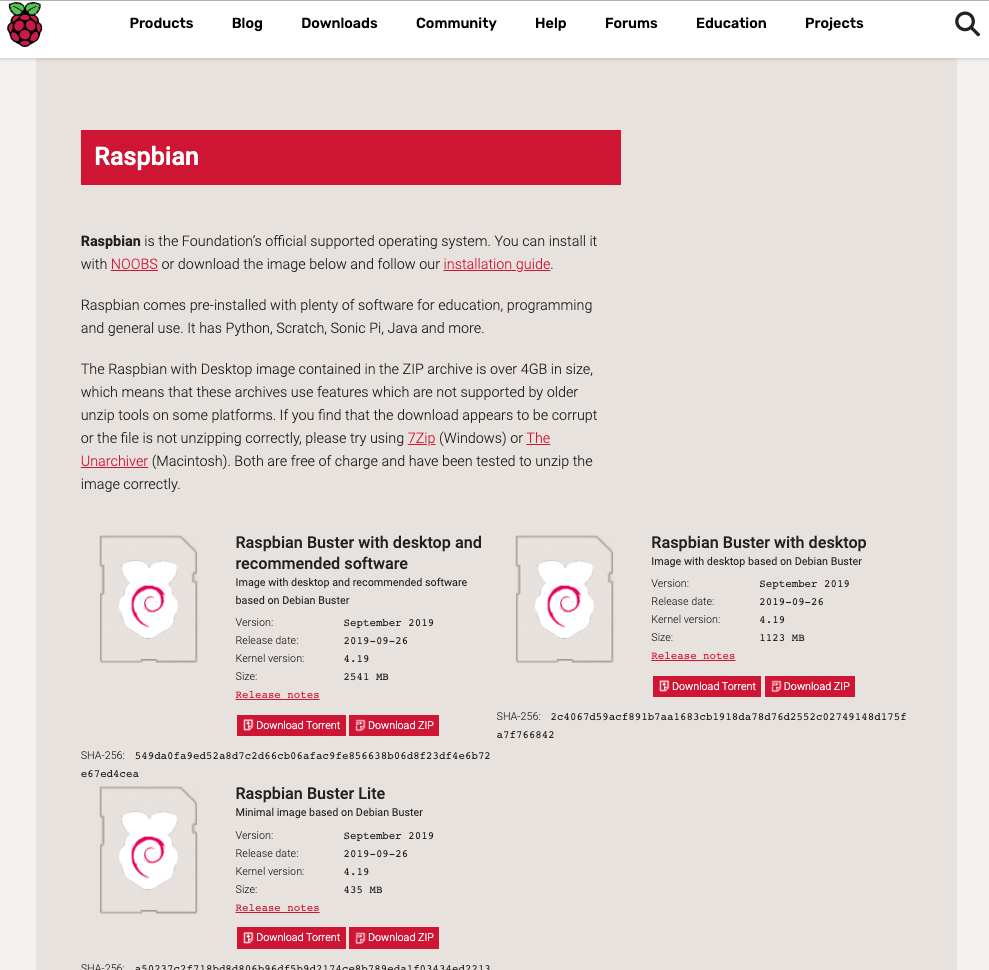
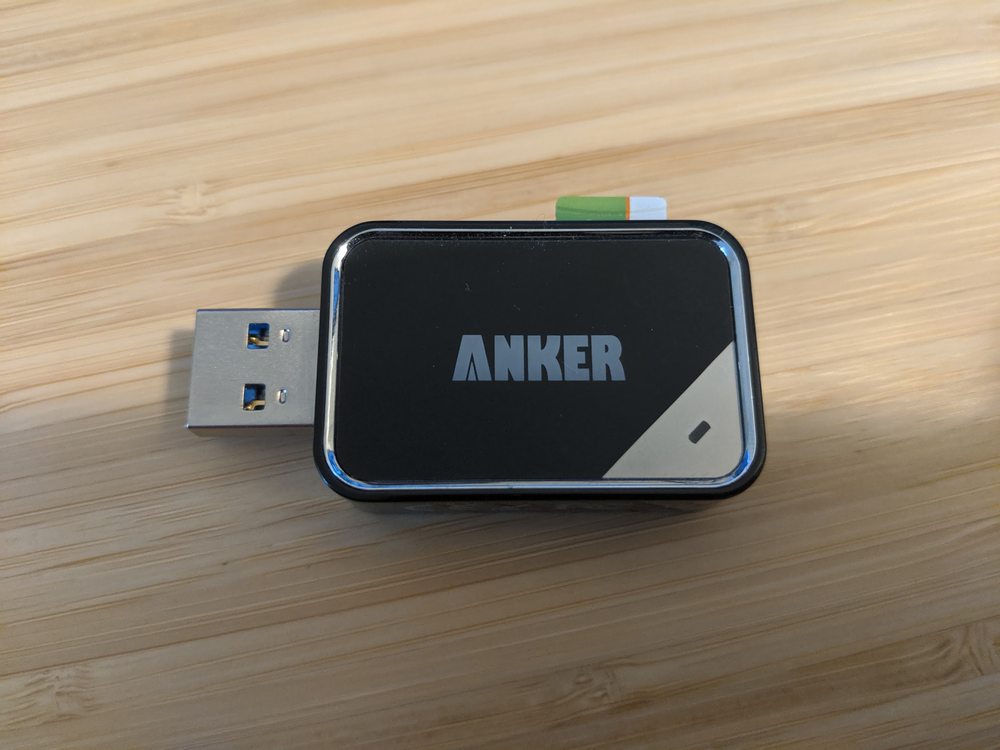
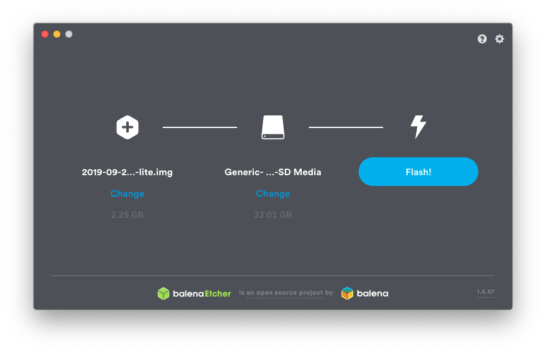
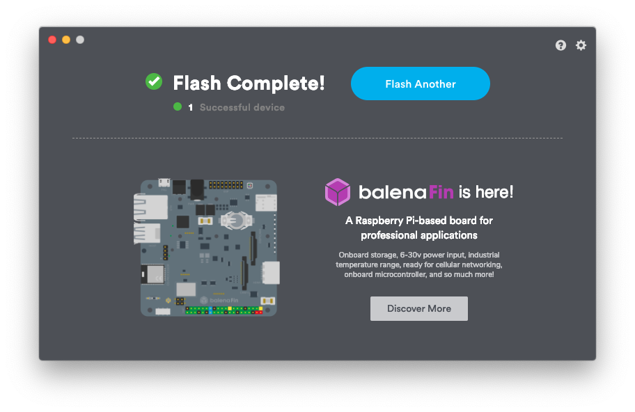
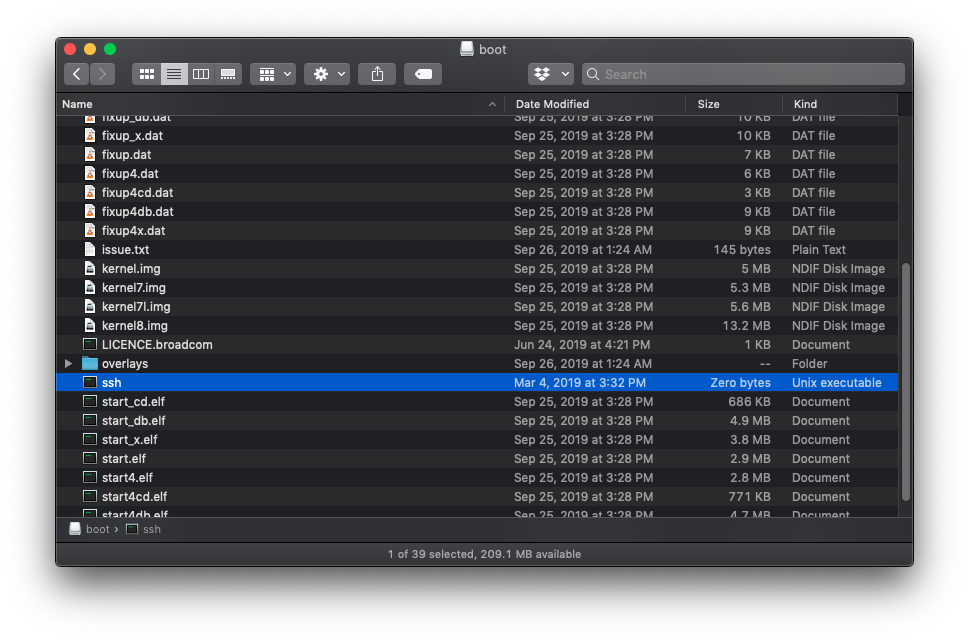

# ARMadillo

## Preparing the Pi's

1. Download the Raspbian OS zip image. ARMadillo was tested working on both [raspbian stretch](https://downloads.raspberrypi.org/raspbian/images/raspbian-2019-04-09/) and [raspbian buster lite](https://www.raspberrypi.org/downloads/raspbian/).




2. Flashing the Pi and the deploy Raspbian is easy. First, download and install [balenaEtcer](https://www.balena.io/etcher/?ref=etcher_footer).
    -   Insert SD card to your SD card reader.
    -   Selecet the Raspbian zip file you've just downloaded.
    -   Select the SD card and hit the "Flash!".
    -   Re-insert the SD card to your SD card reader.
    -   Create *ssh* file and copy it to the */boot* partition. This is required in order to ssh to the Pi. 
    -   Insert the card back to the Pi and power it on.  










## Perquisites

1. Fork this repo :-)

. The env_vars.sh file is the most important file as it will the determine, well, the environment variables for either the single or multi-master based deployment. Edit the *deploy/multi_master/env_vars.sh* file based on your environment. 

- Push the changes to your fork repo.

1. Edit your local hosts file where you will connect to the PI's from and add the HAProxy, masters and workers nodes hostname and IP based on the changes you just made to the *env_vars* file. 

2. On each Pi, upgrade Pi firmware using the ```sudo rpi-update``` command.

	<https://github.com/weaveworks/weave/issues/3717>
    
	<https://github.com/Hexxeh/rpi-update>

## Multi-Master Deployment

1. SSH to the HAProxy node using the allocated DHCP address and the default *raspberry* password.

2. Clone ARMadillo github repository

	```git clone https://github.com/likamrat/ARMadillo.git```

3. 

4. Run the "haproxy_config_hosts.sh" script and wait for the host to restart.

	```./ARMadillo/deploy/multi_master/haproxy_config_hosts.sh```

5. Test successful login using the new hostname/IP and the username/password you allocated in step 3.

5. Repeat steps 1-4 for all remaining masters and workers node. Run the "<node_name>_config_hosts" script on each master/worker respectively:

    - On MASTER01 run: ./ARMadillo/deploy/multi_master/master01_config_hosts.sh
    - On MASTER02 run: ./ARMadillo/deploy/multi_master/master02_config_hosts.sh
    - On MASTER03 run: ./ARMadillo/deploy/multi_master/master03_config_hosts.sh
    - On WORKER01 run: ./ARMadillo/deploy/multi_master/worker01_config_hosts.sh
    - On WORKER02 run: ./ARMadillo/deploy/multi_master/worker02_config_hosts.sh

### Install HAProxy & generate certificates

6. Run the HAProxy installation and certificates generation script.

./ARMadillo/deploy/multi_master/haproxy_install.sh

### Kubernetes nodes perquisites 

7. Run the perquisites script on all masters and workers nodes (no need to run this on the HAProxy Pi)

This step can ~5-10min per node as the script upgrade and update the Pi OS and install kubeadm.  

./ARMadillo/deploy/multi_master/all_k8s_nodes_install_prereq.sh

Before moving to next step, wait for all masters and workers nodes to restart. 

### Install kubeadm

8. On *MASTER01 only*, run the kubeadm initialization script.

./ARMadillo/deploy/multi_master/master01_kubeadm_init.sh

Results should like this:

<ADD_PIC>